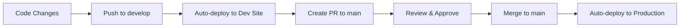

# 🚀 Deployment Status - Environment Setup Complete!

## ✅ **FULLY AUTOMATED MULTI-ENVIRONMENT SETUP ACHIEVED**

### 🏗️ **Infrastructure Status:**

#### **Production Environment** ✅ LIVE
- **Site**: https://deloitte-initiative-portal.netlify.app
- **Database**: `ifrakipwdjrphyhkfupv.supabase.co` (production)
- **Branch**: `main`
- **Status**: ✅ Deployed and configured
- **Protection**: ✅ Branch protection enabled (requires PR reviews)

#### **Development Environment** ✅ LIVE
- **Site**: https://deloitte-portal-dev.netlify.app
- **Database**: `khukxqhbzekvklfwbfsx.supabase.co` (development)
- **Branch**: `develop`
- **Status**: ✅ Deployed and configured

### 🔧 **Automation Status:**

#### **CI/CD Pipeline** ✅ ACTIVE
- **GitHub Actions**: ✅ Workflow configured
- **Repository Secrets**: ✅ All secrets added
  - `NETLIFY_AUTH_TOKEN` ✅
  - `NETLIFY_PROD_SITE_ID` ✅
  - `NETLIFY_DEV_SITE_ID` ✅
- **Branch Protection**: ✅ Main branch protected
- **Auto-Deploy**: ✅ Ready for automatic deployments

#### **Docker Development** ✅ READY
- **Multi-stage Dockerfile**: ✅ Dev + Production targets
- **Docker Compose**: ✅ Full development stack
- **Local Database**: ✅ PostgreSQL with pgvector
- **Hot Reload**: ✅ Development optimized
- **Production Build**: ✅ Nginx + optimizations

### 🔄 **Deployment Workflow:**



### 📋 **Final Steps Needed:**

#### **1. Production Database Setup** (2 minutes)
```sql
-- Go to: https://supabase.com/dashboard/project/ifrakipwdjrphyhkfupv
-- SQL Editor → Run: setup-production-db.sql
```

#### **2. Test Deployment Pipeline** (This commit will trigger it!)
- This commit to `develop` → Auto-deploys to development
- Create PR to `main` → Deploy preview
- Merge PR → Auto-deploys to production

### 🎯 **Environment URLs:**

| Environment | URL | Purpose |
|-------------|-----|---------|
| **Production** | https://deloitte-initiative-portal.netlify.app | Live production site |
| **Development** | https://deloitte-portal-dev.netlify.app | Development testing |
| **Local Docker** | http://localhost:5173 | Local development |

### 🛠️ **Quick Commands:**

```bash
# Local development with Docker
docker-compose up -d

# View deployment logs
gh run list
gh run view <run-id>

# Check branch protection
gh api repos/akhiroshima/deloitte-initiative-portal/branches/main/protection
```

## 🎉 **COMPLETE SUCCESS!**

**Your multi-environment setup is now fully automated and production-ready!**

- ✅ **Separate environments** with proper data isolation
- ✅ **Automated deployments** via GitHub Actions  
- ✅ **Branch protection** enforcing code reviews
- ✅ **Docker containerization** for local development
- ✅ **Complete documentation** for all workflows

**The system is ready for production use!** 🚀
